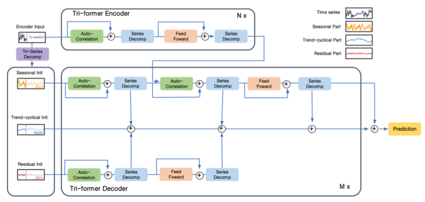
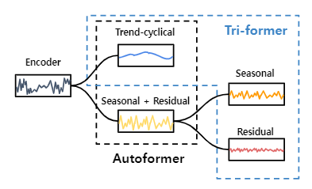
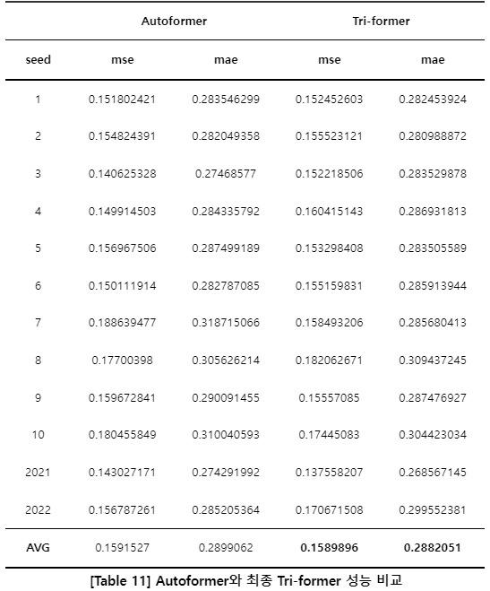

# Tri-Former
## KHU 2022-1학기 캡스톤 디자인1 
-------------
## About the Project
Transformer는 Self-attention mechanism의 장점을 통해 순차적 데이터에 대한 Long-term dependency를 모델링하는데 큰 이점을 얻는다. 그러나 복잡한 시간적 패턴에 가려져 Dependency의 정확한 추론이 어렵고 Quadratic한 복잡도를 가지므로 Long-term 환경에서는 예측이 어렵다. 이에 본 논문에서는 Time-series data에 적합한 구조로 더 정확한 학습과 높은 Computation efficiency를 위해 Autoformer model에 기반을 두고, 입력신호를 3가지 신호로 분리하는 Decomposition Block을 활용하고 AutoCorrelation block의 구조를 바꾼 새로운 모델인 “Tri-Former”을 설계한다.

## Architecture
-----------------
<div align="center"></div>
### Tri-former의 최종 Architecture  

<div align="center"></div>
### Tri-Decomp diagram  

## Getting started
-------------------
1. Install Python 3.6, PyTorch 1.9.0.
2. Download data. You can obtain all the six benchmarks from Tsinghua Cloud or Google Drive. All the datasets are well pre-processed and can be used easily.
3. Train the model. We provide the experiment scripts of all benchmarks under the folder `./scripts`. You can reproduce the experiment results by:
```
bash ./scripts/ETT_script/Autoformer_ETTm1.sh  
bash ./scripts/ECL_script/Autoformer.sh  
bash ./scripts/Exchange_script/Autoformer.sh  
bash ./scripts/Traffic_script/Autoformer.sh  
bash ./scripts/Weather_script/Autoformer.sh  
bash ./scripts/ILI_script/Autoformer.sh  
```

## Main Results
-----------------
<div align="center"></div>


## Contributing
-----------------

1. Fork the project repository
2. Create your branch (git checkout feature/name)
3. Make changes and commit (git commit -m "Input your commit contents")
4. Push to your own Gibhub repository (git push origin feature/name)
5. Create a pull request


## Contact
------------------
김유민 heyday2036@khu.ac.kr
박규리 kyuri0924@khu.ac.kr
